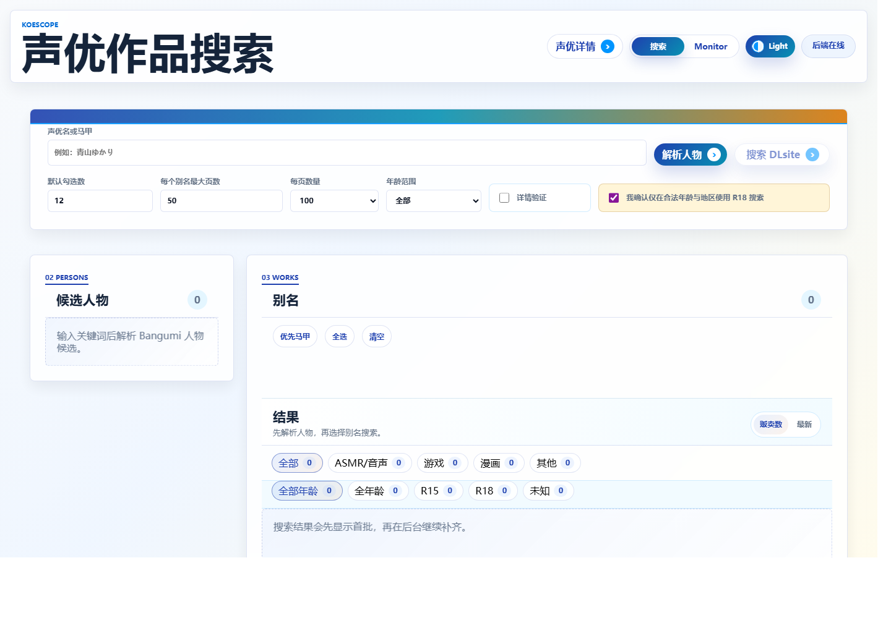
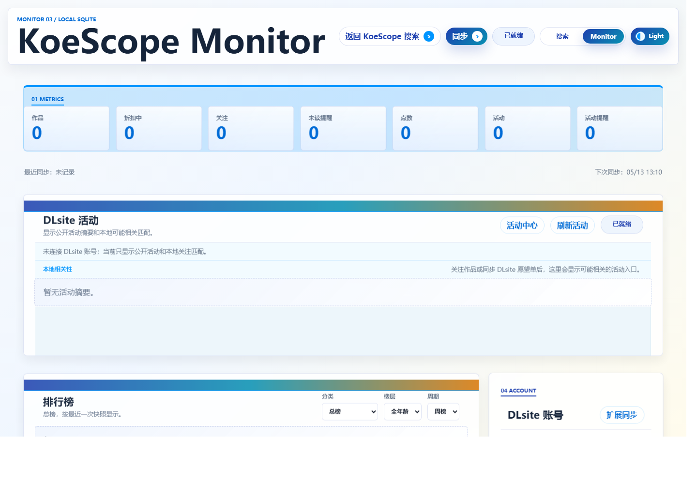
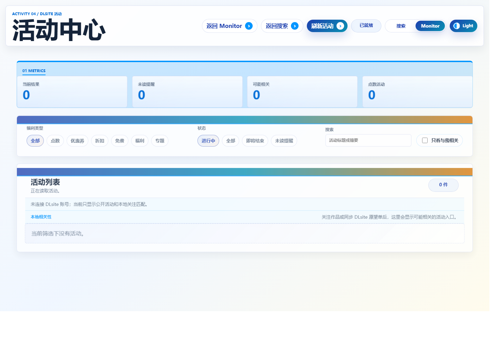

# KoeScope

KoeScope 是一个本地优先的 DLsite / Bangumi 声优作品检索与监控工具。它可以按声优名或马甲解析 Bangumi 人物别名，渐进式搜索 DLsite 公开结果，并把排行榜、价格快照、关注列表、活动提醒和账号页面导入结果保存在本机 SQLite 数据库里。

项目适合两个场景：快速确认某位声优的公开作品脉络，以及长期本地监控自己关注的 DLsite 作品、价格和活动。

## 快速开始

需要 Node.js 20 或更高版本。

```bash
git clone https://github.com/takahasi193/KoeScope.git
cd KoeScope
npm install
npm start
```

首次运行 `npm start` 时，如果仓库里还没有静态前端产物，脚本会自动执行一次 `npm run web:build`，然后启动本地 Express 服务。启动后打开：

- 搜索工作台：`http://localhost:5178`
- 声优详情页：`http://localhost:5178/person.html`
- Monitor 仪表盘：`http://localhost:5178/dashboard.html`
- 活动中心：`http://localhost:5178/activities.html`

Windows 用户也可以双击项目根目录的 `Start-KoeScope.cmd`，或双击 `E:\DL Manager\Start-KoeScope.cmd`。启动器会检查 5178 端口和 `/api/health`，必要时在后台启动 `npm start`。

## 功能亮点

- 声优 / 马甲解析：通过 Bangumi API 获取候选人物、头像、infobox 和别名。
- 渐进式 DLsite 搜索：先显示首批结果，后续页面继续在后台补齐。
- 本地优先缓存：公开搜索缓存与本地关注、注释、账号导入状态叠加展示，不把个人状态写回公开数据。
- 年龄与作品类型筛选：支持全年龄、R18、混合范围和作品形态分类。
- 声优详情页：汇总人物资料、别名、本地搜索记录、热门作品和最新作品。
- 萌娘百科资料补充：人物详情页会按 Bangumi 人物名和马甲尝试读取公开条目，展示简介、来源链接和代表角色 / 作品；远端失败时不影响本地作品库。
- Monitor 仪表盘：查看排行榜快照、价格变化、关注作品、提醒和点数推荐。
- 活动中心：浏览 DLsite 公开活动，并按福利类型、状态、关键词和“与我相关”过滤。
- Chrome companion：可从已登录的 DLsite 页面导入点数、愿望单、收藏和已购作品到本地。

## 界面预览

这些截图来自本地静态前端和临时空数据库，不包含个人账号、愿望单或收藏数据。

### 搜索工作台



### Monitor 仪表盘



### 活动中心



## 常用命令

```bash
npm install        # 安装依赖
npm start          # 首次自动构建静态前端，然后启动本地服务
npm test           # 运行后端 node:test 与前端工具测试
npm run web:build  # 手动重新构建 Next.js 静态前端
npm run web:dev    # 单独运行 Next.js 开发服务器
npm run dev        # 以 watch 模式运行 Express 后端
```

如果 npm registry 或原生依赖安装失败，可以显式使用官方 registry：

```bash
npm install --registry=https://registry.npmjs.org
```

## Chrome Companion

`extension/` 目录提供 Manifest V3 扩展。它用于把浏览器中已登录的 DLsite 账号页面内容导入本地后端，不直接替代后端公开页面抓取逻辑。

安装方式：

1. 先运行本地后端：`npm start`
2. 打开 Chrome 的 `chrome://extensions`
3. 启用“开发者模式”
4. 选择“加载已解压的扩展程序”，加载项目里的 `extension/` 目录
5. 打开扩展面板，配置本地后端地址并同步账号页面

## 本地数据与隐私边界

- SQLite 数据库默认保存在 `data/dlsite-monitor.sqlite`。
- 静态缓存默认保存在 `public/cache/`。
- 账号、愿望单、收藏、已购和本地注释只保存在本机。
- 项目只读取公开页面和用户主动导入的本地账号页面缓存。
- 萌娘百科资料补充仅读取公开条目并使用短期内存缓存，不写入 SQLite、搜索历史或公开搜索缓存。
- 不提供下载、购买、绕过访问限制或绕过年龄确认的能力。
- 活动匹配只表示“可能相关”，不声明用户已经拥有优惠券、领取资格或最终折扣。

## 环境变量

- `PORT`：本地服务端口，默认 `5178`
- `DLSITE_MONITOR_DB`：SQLite 数据库路径
- `DLSITE_MONITOR_AUTO_SYNC=0`：关闭排行榜自动同步
- `DLSITE_MONITOR_DELAY_MS`：排行榜请求间隔，默认 `1500`
- `DLSITE_ACTIVITY_AUTO_SYNC=0`：关闭活动自动同步
- `DLSITE_ACTIVITY_SYNC_INTERVAL_MS`：活动自动同步间隔
- `DLSITE_PERSON_SUBSCRIPTION_AUTO_SYNC=0`：关闭人物订阅自动同步

PowerShell 临时换端口示例：

```powershell
$env:PORT=5180; npm start
```

## API 摘要

基础：

- `GET /api/health`
- `POST /api/persons`
- `GET /api/persons/:id/profile`
- `GET /api/persons/:id/works`
- `POST /api/search/progressive`
- `GET /api/search/progressive/:id`

Monitor：

- `POST /api/sync/dlsite-rankings`
- `GET /api/sync/status`
- `GET /api/dashboard/summary`
- `GET /api/rankings`
- `GET /api/works/:id/history`
- `GET /api/watchlist`
- `POST /api/watchlist`
- `DELETE /api/watchlist/:id`

账号与活动：

- `GET /api/account/dlsite`
- `POST /api/account/dlsite/import-pages`
- `GET /api/recommendations/affordable`
- `POST /api/sync/dlsite-activities`
- `GET /api/activities`
- `GET /api/activity-alerts/summary`
- `POST /api/activity-alerts/:id/read`

## 分享文案

KoeScope 是一个本地优先的 DLsite / Bangumi 声优作品检索与监控工具：输入声优名或马甲即可解析别名、渐进式搜索公开作品，还能在本地监控排行榜、价格、关注作品和活动提醒。安装依赖后运行 `npm start` 就能在浏览器里打开。
